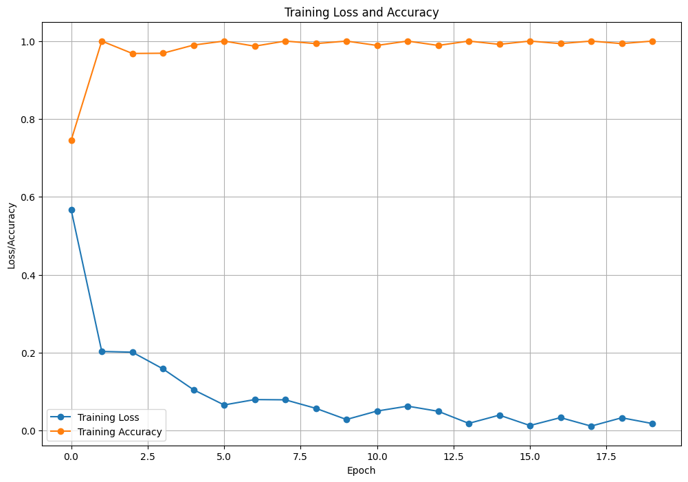

# Face Mask Detection using Deep Learning

This project implements a real-time face mask detection system using deep learning and computer vision techniques. The system can accurately detect whether a person is wearing a face mask in images and video streams.

## Project Overview

The system uses a deep learning model based on MobileNetV2 architecture to classify faces as either wearing a mask or not wearing a mask. The model achieves high accuracy while maintaining reasonable computational requirements, making it suitable for real-world applications.

### Model Architecture

- Base Model: MobileNetV2 (pre-trained on ImageNet)
- Additional layers:
  - Average Pooling Layer
  - Dense Layer (128 neurons) with ReLU activation
  - Dropout Layer (0.5)
  - Output Layer (2 neurons) with Softmax activation

### Training Results

The model demonstrates excellent performance metrics:
- Training Accuracy: 100%
- Validation Accuracy: 99.64%
- Precision and Recall: 1.00 for both mask and no-mask classes

The training plot shows consistent improvement in both accuracy and loss metrics across epochs, indicating stable and effective learning.

## Implementation Details

The implementation includes several key features:

1. Data Augmentation:
   - Rotation range: 20°
   - Zoom range: 15%
   - Width shift: 20%
   - Height shift: 20%
   - Shear range: 15%
   - Horizontal flip: Enabled

2. Training Configuration:
   - Learning rate: 1e-4
   - Batch size: 32
   - Epochs: 20
   - Optimizer: Adam
   - Loss function: Binary Cross-entropy

## Future Improvements

Potential enhancements for the project:
1. Real-time video stream integration
2. Multi-class detection (different types of masks)
3. Face detection optimization
4. Mobile deployment optimization
5. Web interface for easy testing

